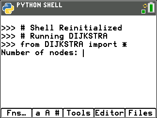
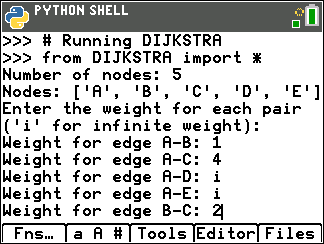
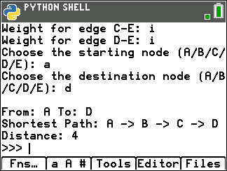
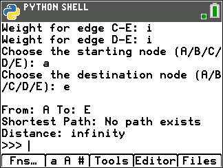

# Dijkstra's Algorithm for Shortest Paths
This program implements [Dijkstra's algorithm](https://en.wikipedia.org/wiki/Dijkstra%27s_algorithm) to find the shortest path between nodes in a graph on the TI-84+ CE graphing calculator using Python.

It allows users to input the number of nodes and the weights between pairs of nodes, and then calculates the shortest path and distance between a specified source and destination node. The program handles up to 26 nodes and infinite weights are denoted by 'i'.

|  |  |
|--------------------------------------------|--------------------------------------------|
|  |  |
